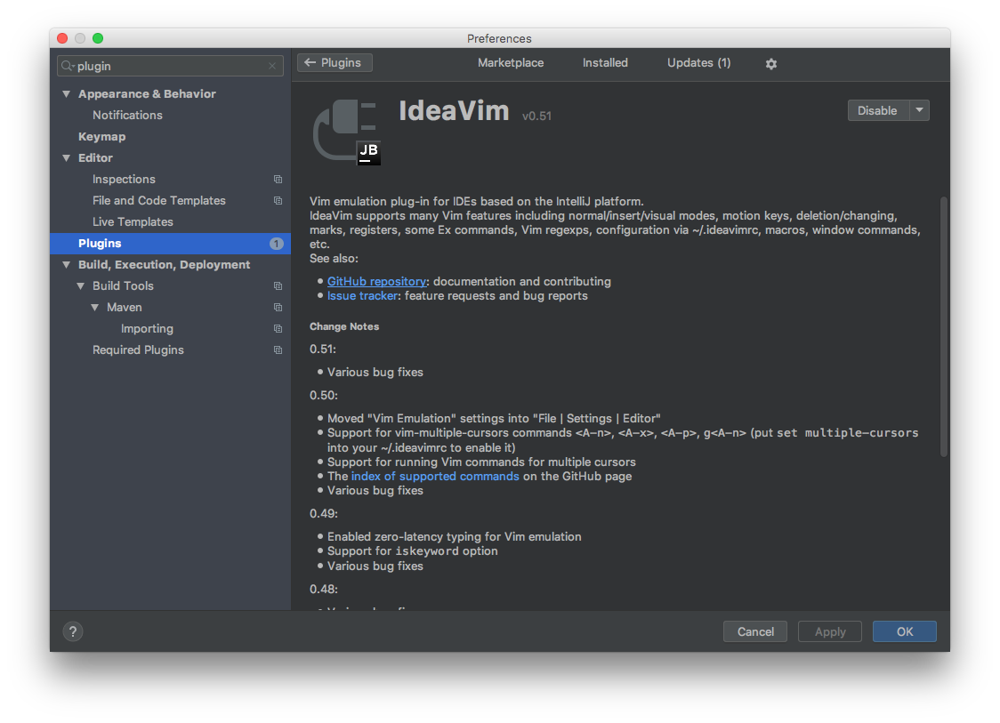
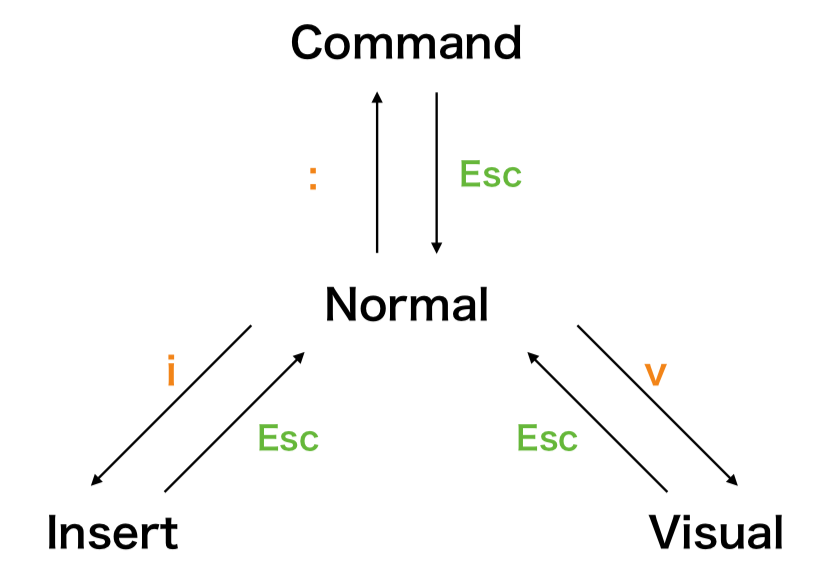

# 挫折しないVim入門

Shintaro TANAKA

---

テキストエディタにこだわってますか？

+++

#### 人類はテキストエディタからは逃れられない

- あらゆる業種にPCは必須 |
  - プログラマやデータサイエンティストに関わらない |
  - 少なくともキーボードに変わる入力手段が出るまでは必須技能 |
- 大工にとっての工具 = プログラマにとってのテキストエディタ |
- 道具にこだわりをもってテキストエディットしよう！！

---

弘法筆を選ばず?

+++

#### 「弘法筆を選ばず」の本当の意味


- 君たちは弘法じゃないから良い筆使おうな！！ |

---

#### テキストエディタにこだわりを持つと起こる変化

PROS

- 退屈な作業でもテキストを打つこと自体が楽しくなる |
- あらゆる作業において入力はボトルネックなので効率が上がる |
- →早く帰ることができる |

CONS

- ないです |

---

#### じゃあテキストエディタ何使えばいいの？

最終目的: 様々な環境で統一感のある作業をする

- 時代は移り変わる |
    - 10数年前 VSCode とか Atom とか SublimeText とかない |
- **キーバインド** を覚える + エディタのキーバインド変えるプラグイン使うのが汎用性が高い |
- じゃあ何のエディタのキーバインド覚えるのがいいのか？ |

---

## Vim


+++

#### Vimの特徴

- 習得すると早い |
- 習得するとつぶしが利く |
- 行単位の編集に強い |
- モードという概念がある |
- 終了・保存 にもコマンド打つ必要がある |
- あらゆるエディタにVimやEmacsがプラグインが作られてる(重要) |

+++

IntelliJ / PyCharm にもあります



+++

#### 日常にあふれるVimのキーバインドに触れる

| サービス名| コマンド|
|:-----------|:------------|
| Twitter | j / k |
| Facebook | j / k |
| Google日本語入力 | <全角入力で>zh zj zk zl|

---

## これだけ覚える操作

+++

### これだけ覚える モード



- Normalモードがすべて中心
- 素振りのように「何かしたらNormalモードに遷移」を手になじませる

+++

| キーボード操作| 機能|
|:-----------|:------------|
| ノーマルモードで `i` | インサートモードに遷移 |
| ノーマルモードで `:(コロン)` | コマンドモードに遷移 |
| ノーマルモードで `v` | 選択モードに遷移 |
| ノーマルモードで `V` | 行選択モードに遷移 |
| ノーマルモードで `Ctrl + V` | 矩形選択モードに遷移 |
| `Esc`/`Ctrl + [` | ノーマルモードに遷移 |

+++

### これだけ覚える カウントとモーション

- モーション…ノーマルモードでカーソルを移動
- カウント… `{数値}{モーション}` で、モーションを数値分繰り返す 

+++

| キーボード操作| 機能|
|:-----------|:------------|
| j | 下にカーソル移動 |
| k | 上にカーソル移動 |
| h | 左にカーソル移動 |
| l (エル) | 右にカーソル移動 |
| w | 次の単語の先頭にカーソル移動 |
| b | 前の単語の先頭にカーソル移動 |
| $ | 行末にカーソル移動|
| ^ | 論理行頭にカーソル移動|

+++

### これだけ覚える オペレータ

- オペレータ…`{オペレータ}{モーション}` で操作をする
- d, y については `dd`, `yy` で行に対して適用可能

+++

| キーボード操作| 機能|
|:-----------|:------------|
| d | 削除 |
| y | ヤンク(コピー) |
| c | 変更(範囲を削除してインサートモードに入ること) |

+++

### これだけ覚える アンドゥ・リドゥ・一文字削除

| キーボード操作| 機能|
|:-----------|:------------|
| u | アンドゥ(取り消し) |
| R | リドゥ(取り消しの取り消し) |
| x | カーソル下の一文字を削除 |

---

## Vimの真髄

+++

### テキストオブジェクト

- `{オペレータ}{テキストオブジェクト}


+++

| キーボード操作| 機能|
|:-----------|:------------|
| iw | カーソル下の単語 |
| aw | カーソル下の単語 |
| i( | ()で囲われたテキスト |
| i" | 'で囲われたテキスト |
| a( | ()で囲われたテキスト(()含む) |
| a" | 'で囲われたテキスト(""含む) |

+++

### .(ドット)コマンド

直前の変更を繰り返すことができる

- 直前の変更
    - 何か消すとか
    - インサートモード入ってから出るまでとか

---

実践

---

ロードマップ

- [キーリピート](https://qiita.com/seteen/items/5698089808612f6b87e0)の速度変える
- JetBrains系のIDEのVimプラグイン `IdeaVim` を入れる
- `hjkl(移動)`, `x(一文字削除)` 、インサートモード⇔ノーマルモードの遷移
  - ここまでで習得すれば今までの作業スピードと同じレベル
- `w / b(単語単位での移動)` 、 `dc (オペレータ)` と.コマンド
- `dd(行削除)`, `yy(行コピー)`, `p(ペースト)`
- いろんなインサートモードへの遷移の仕方、画面単位での行移動、etc

---

これだけ覚えてあなたもVimmer！

ご清聴ありがとうございました

<br/>

想定質問集

- Vimを覚えるにあたり参考になる入門記事はありますか？
- 習得にどれぐらいかかりますか？

---

付録: Vimを覚えるときに参考にする情報源

+++

- vimtutor
- vim-jp Slackグループ
- 実践Vim 思考の速度で編集しよう

+++

vimtutor

- こんなスライドよりまずこれやるべき
- Vim入れるとついてくる
- 日本語訳: mattn, 監修: kaoriya

```sh
$ vimtutor
```

+++

実践Vim 思考の速度で編集しよう

<div style="float: left; width: 45%;">
    
</div>
<br/>
<div style="float: right; width: 55%;">
    <ul>
        <li>こんなスライドよりまずこれやるべき</li>
        <li>紙だとプレミア付いてるけどKindleで買えるMac版Kindle見ながらやるのが勉強するのがオススメ</li>
    </ul>
</div>

+++

巷にあふれる入門記事の見分け方

- ドットコマンド
- テキストオブジェクト

について触れているかどうか
